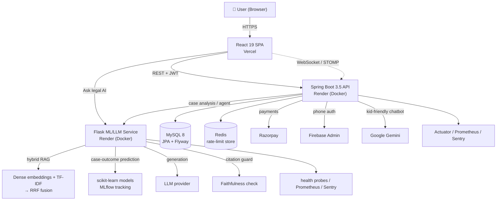

# 🏛️ AI Courtroom

A full-stack legal-tech platform that combines a **role-based case-management workflow** (litigants, lawyers, judges) with a **retrieval-augmented legal AI** that answers questions grounded in statutes and case law — and verifies its own citations before returning them, so it does not invent authorities.

[](https://github.com/dhruv-15-03/AI-CourtRoom/actions/workflows/ci.yml)
[](https://github.com/dhruv-15-03/AI-CourtRoom/actions/workflows/codeql.yml)


> **This repository is the web application (React frontend + Spring Boot backend).** The machine-learning / LLM microservice lives in a separate repo: **[AI-court-AI](https://github.com/dhruv-15-03/AI-court-AI)**.

---

## 🌐 Live Demo

**Frontend:** [ai-court-room-iota.vercel.app](https://ai-court-room-iota.vercel.app/)

> ⚠️ **Cold-start note:** the backend and AI microservice run on Render's free tier and **sleep after inactivity**. The first request after an idle period can take **30–60 seconds** to wake the service, or may briefly return `503` while it boots. Give it a moment and retry. For a guaranteed walkthrough, see the local setup below or **[docs/DEMO.md](docs/DEMO.md)**.

**Seeded demo accounts** (role-based dashboards):

| Role | Email | Password |
|------|-------|----------|
| User | `user@example.com` | `password123` |
| Lawyer | `lawyer@example.com` | `password123` |
| Judge | `judge@example.com` | `password123` |

---

## 🔬 What makes this technically interesting

Most "AI + CRUD" projects stop at *"call an LLM and print the answer."* This one addresses the parts that actually matter in production legal AI:

- **Hybrid retrieval (dense + lexical, fused with RRF).** The RAG pipeline runs a **semantic** leg (sentence-transformer embeddings) and a **lexical** leg (TF-IDF) in parallel, then fuses the two ranked lists with **Reciprocal Rank Fusion** — recovering results that pure vector search or pure keyword search each miss.
- **Citation-faithfulness guard.** After generation, every case/section the answer cites is checked against the retrieved context. Citations that don't appear in the sources are flagged as `unverified`, the response is marked `grounded: false`, and a caution note is attached — instead of confidently returning a hallucinated precedent.
- **Structured LLM outputs with graceful degradation.** Analysis endpoints request JSON-mode (`response_format`) and parse defensively; if a provider rejects structured output, the client transparently retries in plain mode rather than 500-ing.
- **Two-layer resilience against a sleeping/failing AI dependency.**
  - *Backend (Java):* every outbound call to the ML service and Gemini goes through a **per-host Resilience4j circuit breaker** (a `RestTemplate` interceptor). It records `5xx`/IO failures (but treats `4xx` as healthy), opens at a 50% failure rate over a 10-call window, waits 30s, then probes half-open — and **fails fast to a clean `503`** when open, so a dead upstream can't pin servlet threads on the 120s read timeout and cascade into a pool outage. Breaker state is exported to Prometheus so an open breaker is alertable.
  - *AI service (Python):* the LLM client uses **route-aware timeouts** and a **single app-owned retry loop with exponential backoff**, retrying only *transient* failures (429 / 5xx / connection timeouts), never deterministic 4xx — with total latency bounded under the gunicorn worker timeout.
- **Rate limiting with a pluggable backend.** The backend ships a servlet filter with a `RateLimitStore` strategy — **Redis-backed** in production, **in-memory fallback** when Redis is absent — so limits work in both single-node dev and multi-instance deploys.
- **Observability on both tiers.** Prometheus metrics (Micrometer on the backend, `prometheus-client` on the AI service), **Sentry** error tracking, and dedicated **liveness / readiness / health** probes.
- **Real CI/CD.** Backend: Maven build + CodeQL + auto-deploy to Render. AI service: `ruff` → `mypy` → `pytest` (coverage-gated) → `pip-audit` → Docker build → **Trivy** image scan → CodeQL. Frontend: Vercel build/deploy.

---

## 🏗️ Architecture



A deeper write-up of the design decisions is in **[docs/ARCHITECTURE.md](docs/ARCHITECTURE.md)**.

---

## ✨ Features

### Role-based workflows
- **Users / litigants** — find and request lawyers, track cases, ask the legal AI.
- **Lawyers** — accept/reject case requests, manage active cases, dashboard analytics, subscriptions.
- **Judges** — review pending cases, examine documents, deliver judgments.

### AI capabilities
- **Legal Q&A (RAG)** — grounded answers with verified citations (AI microservice).
- **Case-outcome prediction** — ML model over case features (AI microservice).
- **Case analysis** — structured extraction/analysis endpoints (backend ↔ AI microservice).
- **Assistant chatbot** — a lightweight Google **Gemini** chatbot wired directly into the backend (`/api/ai`), separate from the heavy ML service. See [`GEMINI_AI_SETUP.md`](GEMINI_AI_SETUP.md).

### Platform
- **Real-time chat** between users and lawyers over WebSocket + STOMP.
- **Payments** via Razorpay; **subscriptions** for lawyers.
- **Auth** — JWT (stateless) + Firebase phone verification; BCrypt password hashing; role-based access control.
- **Notifications & audit** — email (SMTP) and an audit trail.

> Video conferencing is scaffolded behind a feature flag (`REACT_APP_ENABLE_VIDEO_CALLS`) and is **not** enabled in the current deployment — see the roadmap.

---

## 🧰 Tech Stack

### Frontend — `frontend/`
React **19.1** · Material-UI **7** + `@mui/x-data-grid` 8 · React Router **7** · Axios · Formik + Yup · STOMP / SockJS · `react-markdown` · Sentry · Tailwind CSS 3.4 · Create React App (`react-scripts` 5) · **Host: Vercel**

### Backend — `backend/demo/`
Java **21** · Spring Boot **3.5.16** · Spring Security + JWT (`jjwt` 0.13) · Spring Data JPA · MySQL **8** · **Flyway** migrations · Redis (rate limiting) · **Resilience4j** (per-host circuit breaker) · Spring Actuator + Micrometer/Prometheus · WebSocket · Razorpay · Firebase Admin · Spring Mail · Maven · **Host: Render (Docker)**

### AI microservice — [`AI-court-AI`](https://github.com/dhruv-15-03/AI-court-AI)
Python **3.10+** · Flask + Flask-CORS · Flask-Limiter · `sentence-transformers` / `transformers` / `torch` · scikit-learn · NLTK · `umap-learn` + `hdbscan` (clustering) · **MLflow** · `prometheus-client` · Sentry · Flasgger (Swagger) · **Host: Render (Docker)**

---

## 📁 Repository Structure

```
AI-CourtRoom/
├── frontend/                     # React 19 SPA (CRA)
│   ├── src/
│   │   ├── components/           # Reusable UI
│   │   ├── pages/                # User / Lawyer / Judge views
│   │   ├── contexts/             # React context providers
│   │   ├── services/             # API layer (api.js → backend + AI)
│   │   └── utils/
│   ├── vercel.json               # SPA rewrites + security headers + CSP
│   └── package.json
│
├── backend/demo/                 # Spring Boot API
│   ├── src/main/java/com/example/demo/
│   │   ├── Controller/           # 14 REST controllers
│   │   ├── Config/               # Security, rate limiting, CORS, Redis
│   │   ├── Classes/              # JPA entities
│   │   ├── Repository/           # Spring Data repositories
│   │   └── Implementation/       # Service layer
│   ├── src/main/resources/       # application.properties, Flyway migrations
│   ├── Dockerfile · docker-compose.yaml
│   └── pom.xml
│
├── docs/                         # Architecture + demo walkthrough
├── GEMINI_AI_SETUP.md            # Direct-Gemini chatbot setup
└── README.md
```

---

## 🚀 Local Setup

**Prerequisites:** Node.js 18+ · Java 21 · Maven 3.9+ · MySQL 8 (or use the H2 fallback) · (optional) the [AI-court-AI](https://github.com/dhruv-15-03/AI-court-AI) service running locally or the hosted URL.

```bash
git clone https://github.com/dhruv-15-03/AI-CourtRoom.git
cd AI-CourtRoom
```

**1. Backend** (`http://localhost:8081`)
```bash
cd backend/demo
cp .env.example .env        # fill in DB / JWT / integration keys
mvn spring-boot:run
```

**2. Frontend** (`http://localhost:3000`)
```bash
cd frontend
cp .env.example .env        # REACT_APP_API_URL, REACT_APP_AI_API_URL
npm install
npm start
```

Full environment-variable reference and troubleshooting is in **[DEVELOPMENT.md](DEVELOPMENT.md)**.

---

## 🔗 API Surface (backend)

REST controllers are mounted under these roots (JWT-protected except auth):

| Root | Purpose |
|------|---------|
| `/auth` | login / signup |
| `/api/user` | user profile, lawyer discovery, cases, chats |
| `/api/lawyer` | dashboard, case requests, active cases |
| `/api/judge` | pending cases, case detail, judgments |
| `/api/cases`, `/api/hearings` | case & hearing lifecycle |
| `/api/subscription` | lawyer subscriptions (Razorpay) |
| `/api/verification`, `/api/audit` | identity verification, audit trail |
| `/api/ai` | Gemini assistant chatbot |
| `/api/agent`, `/api/ai-analysis` | bridge to the ML/LLM microservice |
| `/actuator/health`, `/actuator/prometheus` | health & metrics |

---

## 🔐 Security

- **JWT** stateless auth + **role-based access control** (User / Lawyer / Judge).
- **BCrypt** password hashing.
- **Rate limiting** filter (Redis-backed, in-memory fallback).
- **CORS** allow-list + a strict **Content-Security-Policy** (see `frontend/vercel.json`).
- Server- and client-side **input validation** (Spring Validation · Formik/Yup).
- **Parameterized queries** via JPA; secrets injected through environment variables (`spring-dotenv`).
- **CodeQL** static analysis + (AI service) **Trivy** image scanning and `pip-audit` in CI.

---

## 🗺️ Roadmap

**Done**
- Role-based auth, dashboards, and case management
- Lawyer discovery + request workflow
- Real-time chat (WebSocket/STOMP)
- RAG legal Q&A with citation verification + case-outcome prediction
- Gemini assistant chatbot
- CI/CD, rate limiting, metrics, health probes

**Planned**
- Document upload & management for cases
- Video conferencing (flag currently off)
- Broader evaluation harness for AI answer quality
- Multi-language support

---

## 📄 License

© 2026 Dhruv Rastogi. All rights reserved. This source is published for review and portfolio purposes; it is **not** licensed for redistribution or commercial reuse without permission.

## 🙌 Acknowledgments

- **[AI-court-AI](https://github.com/dhruv-15-03/AI-court-AI)** — the ML/LLM microservice powering retrieval-augmented answers and case prediction.
- Material-UI, Spring Boot, and the open-source ML ecosystem (Hugging Face, scikit-learn, PyTorch).
