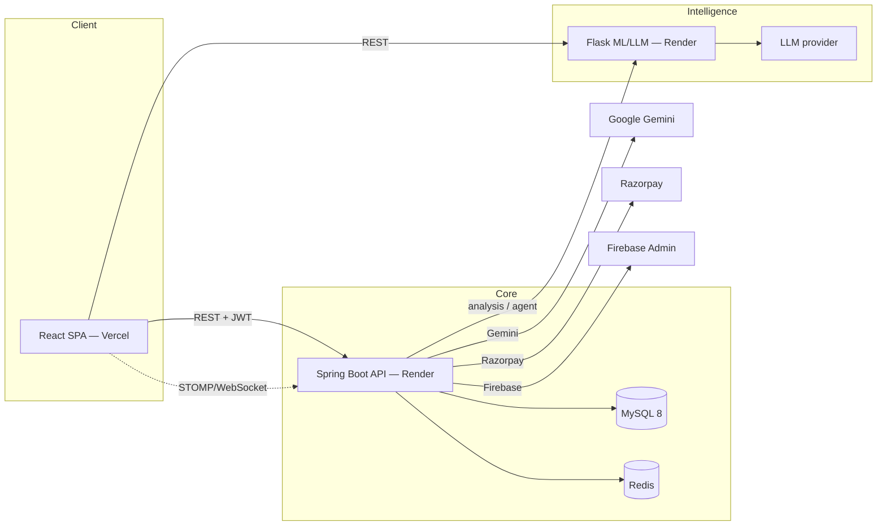
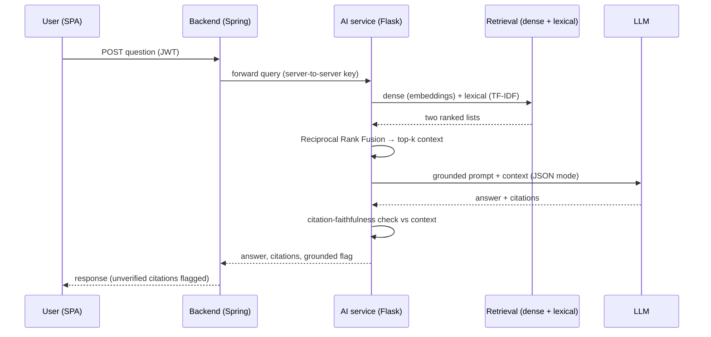

# Architecture

This document explains how **AI Courtroom** is put together and *why* the non-obvious decisions were made. It is aimed at an engineer evaluating the system, not at end users.

## System overview

Three independently deployed tiers:

| Tier | Tech | Host | Responsibility |
|------|------|------|----------------|
| **Frontend** | React 19 SPA (CRA) | Vercel | UI, routing, role-based views, JWT handling, WebSocket client |
| **Backend** | Spring Boot 3.5 / Java 21 | Render (Docker) | Auth, domain/business logic, persistence, payments, realtime, API gateway to AI |
| **AI service** | Flask / Python | Render (Docker) | Retrieval-augmented Q&A, case-outcome prediction, analysis |

### Why a separate AI microservice?

The ML stack (PyTorch, sentence-transformers, transformers, scikit-learn, UMAP/HDBSCAN, MLflow) is heavy, has a different release cadence, and needs a different CI (model training/evaluation, image scanning). Keeping it out of the Spring Boot process means:

- the JVM app stays small and boots fast on a constrained free-tier container;
- the Python service can scale, be redeployed, and fail **independently** of the transactional core;
- the backend treats AI as a remote dependency with **timeouts and retries**, so an AI outage degrades gracefully instead of taking down case management.

---

## Request flow: a legal question

---

## Key design decisions

### 1. Hybrid retrieval with Reciprocal Rank Fusion
Pure vector search misses exact statutory references ("Section 420 IPC"); pure keyword search misses paraphrases. The pipeline runs both legs and fuses them with **RRF** (`score = Σ 1/(k + rank)`), which needs no score normalization between the two very different scoring systems. When only one leg is available (e.g. embeddings not loaded), it degrades to that leg instead of failing.

### 2. Citation faithfulness as a guardrail
LLMs hallucinate case names and section numbers with total confidence — a serious liability in legal tech. After generation, `verify_citations()` extracts every citation from the answer and checks it against the retrieved documents. Anything not found is returned in `unverified_citations`, `grounded` is set to `false`, and a caution note is appended. The system **surfaces** uncertainty rather than hiding it.

### 3. Structured outputs with fallback
Analysis endpoints need machine-parseable JSON. The LLM client requests `response_format` (JSON mode) and parses defensively. Some providers/models reject `response_format`; the client detects the rejection markers and **transparently retries** without structured output, so a provider quirk never becomes a 500.

### 4. Two complementary resilience layers
The system defends against a slow or dead AI dependency at **both** ends of the call:

**Backend → AI (Resilience4j circuit breaker).** Every outbound `RestTemplate` call passes through `AiResilienceInterceptor`, which wraps it in a **per-host** circuit breaker:
- **COUNT_BASED** sliding window (size 10), opens at a **50% failure rate** after a minimum of 5 calls;
- **30s** in the open state, then **3 permitted half-open probes** before closing;
- `5xx` and IO/connection errors count as failures; **`4xx` counts as healthy** (the upstream is alive, it just rejected our request);
- when **open**, the call is rejected *without hitting the network* → surfaces as a `ResourceAccessException` the AI controllers already catch → clean **`503` fallback** instead of a hang;
- per-host keying means an ML-service outage never trips the Gemini breaker;
- all tunable via `ai.resilience.*` / `AI_CB_*` env vars, and breaker state is bound to Micrometer/Prometheus so it's observable and alertable.

This exists because the shared `RestTemplate` has a 120s read timeout for heavy analysis; without a breaker, a sleeping upstream would hold servlet threads for the full 120s and exhaust the pool.

**AI service → LLM (bounded retry).** Inside the Python service, the LLM client owns a **single** retry loop (the SDK's own retries are disabled) with **route-aware timeouts**, **exponential backoff** (capped), and **transient-only** retries (429/5xx/connection-timeout retried; deterministic 4xx not). Total latency is kept under the gunicorn worker timeout.

Together: the breaker stops the *backend* from waiting on a dead dependency; the retry loop lets the *AI service* ride out a brief upstream blip.

### 5. Pluggable rate limiting
A servlet `RateLimitFilter` sits in front of the API backed by a `RateLimitStore` interface with two implementations: **`RedisRateLimitStore`** (shared, correct across multiple instances) and **`InMemoryRateLimitStore`** (zero-dependency fallback for local/dev). The store is selected by configuration, so the same code path works whether or not Redis is provisioned.

### 6. Two distinct AI paths (by design)
- **`/api/ai` (Gemini)** — a lightweight assistant chatbot wired directly into the backend for quick, conversational Q&A. Low latency, no retrieval.
- **`/api/agent` + `/api/ai-analysis` → Flask service** — the heavyweight retrieval-augmented reasoning and prediction.

They are separate because their latency, cost, and failure characteristics are different, and conflating them would force the cheap path to pay the expensive path's cold-start cost.

---

## Persistence & migrations
- **MySQL 8** via Spring Data JPA / Hibernate.
- **Flyway** for versioned, repeatable schema migrations (opt-in via `FLYWAY_ENABLED`), so schema changes are reviewable and reproducible rather than auto-`ddl`-guessed in production.

## Observability
- **Backend:** Spring Actuator + Micrometer → Prometheus (`/actuator/prometheus`); mail/redis health indicators explicitly disabled where they'd cause false-negative health on Render.
- **AI service:** `prometheus-client` metrics, and **liveness / readiness / deep-health** probes so an orchestrator can distinguish "process up" from "dependencies ready."
- **Both:** Sentry error tracking.

## Security posture
JWT stateless auth + RBAC · BCrypt hashing · CORS allow-list · strict CSP (`frontend/vercel.json`) · parameterized JPA queries · secrets via env (`spring-dotenv`) · CodeQL on both repos · Trivy + `pip-audit` on the AI image.

## Known constraints (honest)
- All three tiers run on **free tiers** (Vercel + Render); the two Render services **sleep** and cold-start.
- No meaningful automated frontend test suite yet.
- Single replica per service, so the circuit breaker is an in-process (per-instance) breaker rather than a shared/distributed one.
